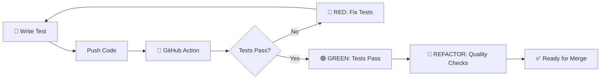

# 🚀 GitHub Actions CI/CD pour Geneweb Python Migration

Ce dossier contient les workflows GitHub Actions pour automatiser les tests, la qualité du code et le suivi de la migration.

## 📋 Workflows disponibles

### 🐍 `python-tests.yml` - Tests Python TDD
**Déclencheurs**: Push sur toutes les branches, PR vers main/dev
**Objectif**: Validation complète du code Python

- ✅ **Multi-plateforme**: Ubuntu, Windows, macOS
- ✅ **Multi-version**: Python 3.9 à 3.13
- ✅ **Qualité code**: black, isort, flake8, mypy
- ✅ **Tests TDD**: Validation du cycle Red-Green-Refactor
- ✅ **Couverture**: Rapport de couverture avec Codecov
- ✅ **Pre-commit**: Validation des hooks Git

### 🐪 `ocaml-tests.yml` - Tests OCaml Référence
**Déclencheurs**: Push sur main/dev, PR
**Objectif**: Maintenir la référence des 50 tests OCaml

- ✅ **Baseline**: 50 tests OCaml comme référence
- ✅ **Compilation**: Vérification que l'OCaml compile
- ✅ **Métriques**: Extraction des résultats de tests
- ✅ **Archive**: Sauvegarde des rapports de tests

### ⚖️ `migration-progress.yml` - Suivi Migration
**Déclencheurs**: Push, PR, schedule hebdomadaire
**Objectif**: Suivre l'avancement de la migration Python

- 📊 **Comptage automatique**: Tests Python vs OCaml
- 📈 **Progression**: Pourcentage d'avancement
- 🎯 **Catégories**: Suivi par module (Sosa, Place, etc.)
- 💾 **Badge**: Génération de badge de progression
- 📦 **Rapports**: Archives des rapports de progression

## 🔄 Workflow TDD intégré

Les GitHub Actions supportent le cycle TDD complet :



## 📊 Badges de statut

Une fois les workflows configurés, vous pouvez ajouter ces badges à votre README :

```markdown


```

## 🎯 Objectifs de qualité

- **Couverture**: 90% minimum (sera appliqué une fois les modules implémentés)
- **Tests**: 50 tests Python équivalents aux tests OCaml
- **Qualité**: Toutes les vérifications (black, flake8, mypy) doivent passer
- **TDD**: Validation du cycle Red-Green-Refactor

## 🔧 Configuration locale

Pour reproduire les vérifications CI en local :

```bash
cd geneweb_python

# Tests complets comme en CI
make ci-test

# Qualité comme en CI
make ci-quality

# Cycle TDD complet
make dev-cycle
```

## 📈 Suivi de progression

Le workflow `migration-progress.yml` génère automatiquement :

- 📊 Rapports de progression hebdomadaires
- 🎯 Suivi par catégorie de tests
- 💾 Badges de progression
- 📦 Archives des métriques

Cela vous permet de suivre facilement l'avancement de votre migration OCaml → Python !
