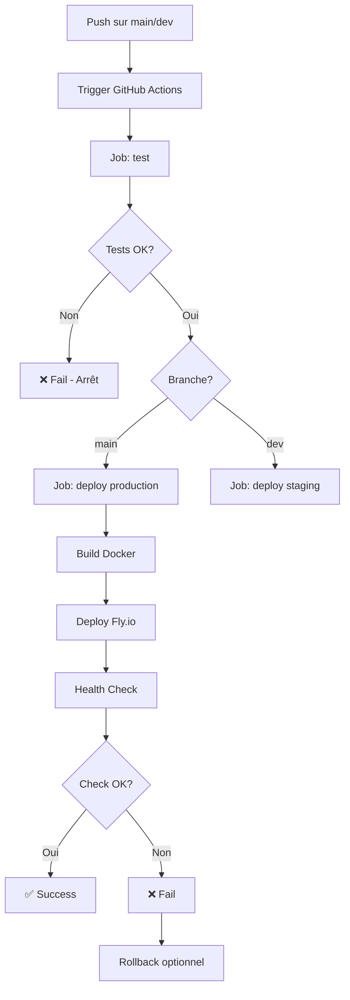

# Configuration GitHub Actions pour Fly.io

Ce guide explique comment configurer le déploiement automatique sur Fly.io via GitHub Actions.

## 📋 Vue d'ensemble

Le workflow GitHub Actions déploie automatiquement l'API Geneweb sur Fly.io lorsque :
- Un push est effectué sur la branche `main` (production)
- Un push est effectué sur la branche `dev` (staging - optionnel)
- Des modifications sont détectées dans `geneweb_python/`

## 🔐 Configuration des secrets GitHub

### Étape 1 : Obtenir le token Fly.io

```bash
# Se connecter à Fly.io
flyctl auth login

# Générer un token d'accès
flyctl auth token
```

Copier le token généré (format : `fo1_xxxxxxxxxxxxxxxxxxxxxxxxxxxxxxxxxxxxx`)

### Étape 2 : Ajouter le secret dans GitHub

1. Aller sur GitHub : `https://github.com/EpitechPGE45-2025/G-ING-900-PAR-9-1-legacy-22`
2. Cliquer sur **Settings** (Paramètres)
3. Dans le menu latéral, cliquer sur **Secrets and variables** → **Actions**
4. Cliquer sur **New repository secret**
5. Configurer :
   - **Name** : `FLY_API_TOKEN`
   - **Secret** : Coller le token Fly.io obtenu à l'étape 1
6. Cliquer sur **Add secret**

## 🚀 Utilisation

### Déploiement automatique (main)

```bash
# Faire des modifications dans geneweb_python/
git add geneweb_python/
git commit -m "feat: nouvelle fonctionnalité"
git push origin main
```

Le workflow GitHub Actions :
1. ✅ Lance les tests
2. ✅ Build l'image Docker
3. ✅ Déploie sur Fly.io (si tests OK)
4. ✅ Vérifie le health check

### Déploiement manuel

Depuis GitHub :
1. Aller sur **Actions**
2. Sélectionner **🚀 Deploy to Fly.io**
3. Cliquer sur **Run workflow**
4. Choisir la branche
5. Cliquer sur **Run workflow**

### Déploiement staging (dev)

Pour activer le déploiement staging, créer une application Fly.io séparée :

```bash
# Créer l'app staging
flyctl apps create geneweb-api-staging --org personal

# Créer la base de données staging
flyctl postgres create --name geneweb-db-staging --region ams --initial-cluster-size 1

# Attacher la DB
flyctl postgres attach geneweb-db-staging --app geneweb-api-staging

# Créer le volume
flyctl volumes create geneweb_data --region ams --size 1 --app geneweb-api-staging

# Configurer les secrets
flyctl secrets set \
  GENEWEB_SECURITY_SECRET_KEY="votre_secret_key_staging" \
  GENEWEB_SECURITY_ENCRYPTION_KEY="votre_encryption_key_staging" \
  --app geneweb-api-staging
```

Puis dans `.github/workflows/deploy-flyio.yml`, décommenter :
```yaml
flyctl deploy --remote-only --app geneweb-api-staging
```

## 📊 Workflow détaillé

### 1. Job `test` (Requis)

```yaml
- Run tests Python 3.11
- Coverage report
- Fail si tests échouent
```

### 2. Job `deploy` (Production - main)

```yaml
- Setup Fly.io CLI
- Deploy avec flyctl
- Verify health check
- Fail si deployment échoue
```

### 3. Job `deploy-staging` (Staging - dev)

```yaml
- Setup Fly.io CLI
- Deploy sur app staging
- Optionnel (à configurer)
```

## 🔍 Monitoring du déploiement

### Voir les logs GitHub Actions

1. Aller sur **Actions** dans le repo GitHub
2. Cliquer sur le workflow en cours
3. Voir les logs détaillés de chaque étape

### Voir les logs Fly.io

```bash
# Logs de production
flyctl logs --app geneweb-api

# Logs de staging
flyctl logs --app geneweb-api-staging
```

## 🐛 Dépannage

### Erreur : "Error: no access token provided"

**Cause** : Le secret `FLY_API_TOKEN` n'est pas configuré.

**Solution** : Suivre les étapes de configuration des secrets ci-dessus.

### Erreur : "Error: failed to fetch an image or build from source"

**Cause** : Problème avec le build Docker.

**Solution** :
1. Vérifier que `Dockerfile.fly` est présent
2. Tester le build localement : `docker build -f Dockerfile.fly -t test .`
3. Vérifier les logs GitHub Actions

### Erreur : "Health check failed"

**Cause** : L'application ne répond pas après le déploiement.

**Solution** :
1. Vérifier les logs : `flyctl logs --app geneweb-api`
2. Vérifier le statut : `flyctl status --app geneweb-api`
3. Se connecter à la machine : `flyctl ssh console --app geneweb-api`

### Le workflow ne se déclenche pas

**Cause** : Les modifications ne sont pas dans `geneweb_python/`

**Solution** : Vérifier le path filter dans le workflow :
```yaml
paths:
  - 'geneweb_python/**'
```

## 🎯 Bonnes pratiques

### 1. Protection de la branche main

Configurer dans **Settings** → **Branches** → **Branch protection rules** :
- ✅ Require a pull request before merging
- ✅ Require status checks to pass (tests)
- ✅ Require conversation resolution before merging

### 2. Environnements GitHub

Créer des environnements pour contrôler les déploiements :

1. **Settings** → **Environments**
2. Créer "production" et "staging"
3. Ajouter des reviewers requis pour production
4. Configurer les secrets par environnement

Modifier le workflow :
```yaml
deploy:
  environment: production  # Requiert approbation
  name: Deploy to Production
```

### 3. Rollback automatique

Ajouter un job de rollback en cas d'échec :

```yaml
rollback:
  name: 🔄 Rollback on Failure
  runs-on: ubuntu-latest
  needs: deploy
  if: failure()
  steps:
    - uses: superfly/flyctl-actions/setup-flyctl@master
    - run: flyctl releases rollback --app geneweb-api
      env:
        FLY_API_TOKEN: ${{ secrets.FLY_API_TOKEN }}
```

### 4. Notifications

Intégrer des notifications Slack/Discord :

```yaml
- name: 📢 Notify Slack
  if: always()
  uses: 8398a7/action-slack@v3
  with:
    status: ${{ job.status }}
    webhook_url: ${{ secrets.SLACK_WEBHOOK }}
```

## 📝 Variables d'environnement disponibles

Dans le workflow GitHub Actions :

| Variable | Description | Exemple |
|----------|-------------|---------|
| `github.ref` | Référence de la branche | `refs/heads/main` |
| `github.sha` | SHA du commit | `abc123...` |
| `github.actor` | Utilisateur qui a push | `username` |
| `github.event_name` | Type d'événement | `push` |

Utilisation :
```yaml
run: echo "Deploying ${{ github.sha }} to production"
```

## 🔄 Workflow complet



## 📚 Ressources

- [GitHub Actions Documentation](https://docs.github.com/en/actions)
- [Fly.io GitHub Actions](https://fly.io/docs/app-guides/continuous-deployment-with-github-actions/)
- [superfly/flyctl-actions](https://github.com/superfly/flyctl-actions)

## ✅ Checklist

Configuration du déploiement automatique :

- [ ] Token Fly.io généré (`flyctl auth token`)
- [ ] Secret `FLY_API_TOKEN` ajouté dans GitHub
- [ ] Workflow `.github/workflows/deploy-flyio.yml` créé
- [ ] Tests du workflow sur une branche test
- [ ] Protection de la branche main configurée (optionnel)
- [ ] Environnements GitHub créés (optionnel)
- [ ] App staging Fly.io créée (optionnel)
- [ ] Notifications configurées (optionnel)

## 🎓 Exemple de déploiement

```bash
# 1. Créer une nouvelle feature
git checkout -b feature/new-endpoint
# ... modifications ...

# 2. Commit et push
git add .
git commit -m "feat: add new API endpoint"
git push origin feature/new-endpoint

# 3. Créer une Pull Request vers main
# → Tests s'exécutent automatiquement

# 4. Merge la PR
# → Déploiement automatique sur Fly.io

# 5. Vérifier le déploiement
curl https://geneweb-api.fly.dev/health/
```

---

**Note** : Le workflow est configuré pour déployer uniquement sur `main`. Pour déployer sur `dev`, activer le staging comme décrit ci-dessus.
